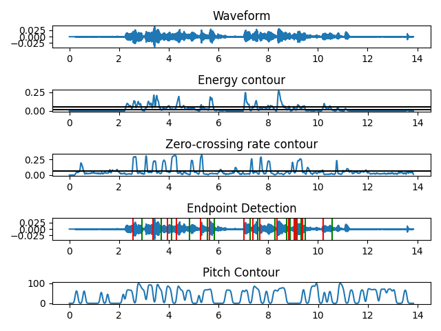
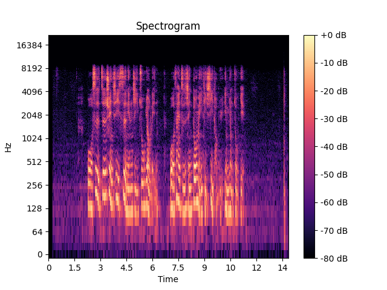

# 2024 Multimedia HW2

## Prerequisites
Make sure that you have your python and pip installed on your computer.

Run
```bash
$ python3 -m pip install -r requirements.txt
```
to get all you need to run the code.

## Usage
Simply run
```bash
$ python3 main.py <audio file path>
```
to get the results.

A sample audio file `F74091019_multimedia_hw1_v1.mp3` in this directory is used as the example for the following description.

Run
```bash
$ python3 main.py F74091019_multimedia_hw1_v1.mp3
```
to get the example.

## Extract the speech features in Time Domain
The main package used here to compute audio data is `librosa`.

```python
from librosa import load, frames_to_time, pyin, note_to_hz, stft, amplitude_to_db
from librosa.display import specshow
from librosa.feature import zero_crossing_rate
from sys import argv
from matplotlib.pyplot import show, savefig, subplots, tight_layout, figure, colorbar, title, gcf
from numpy import array, mean, where, percentile, isnan, nan, median, abs, max
from scipy.ndimage import gaussian_filter1d
```

Methods are detailed below.

### Waveform
```python
x, sr = load(argv[1], sr=None)
t = frames_to_time(range(len(x)), sr = sr, hop_length = 1)
ax[0].plot(t, x)
```
is used here to get the input audio data and plot it.

### Energy Contour
The energy of a signal corresponds to the total magntiude of the signal. For audio signals, that roughly corresponds to how loud the signal is. The energy in a signal is defined as
$$ \sum_n{|x[n]|}^2 $$

Absolue value can be omitted since there is square.

Since, we want to draw the contour, the range of x[n] shouldn't be all sample points at once. Instead, we use sums of rather small ranges of n (frames) every time and then hop.

Here we have `2048` points per frame and `512` points per.

Equivalence code is
```python
energy = array([
    sum(x[i: i + 1024] ** 2)
    for i in range(0, len(x), 512)
])

t = frames_to_time(range(len(energy)), sr = sr)
ax[1].plot(t, energy)
```

### Zero-crossing rate contour
Here we still have `2048` points per frame and `512` points per as default.

```python
zcr = zero_crossing_rate(x + 0.0001)[0]
ax[2].plot(t, zcr)
```
A small constant `0.0001` has been added into x to suppress the high rate near the beginning because the silence oscillates quietly around zero.

### End point detection
Here I did my best to simulate the algorithm from the powerpoint:
> Algorithm
> 1. It is assumed that the first 100ms of the interval contains no speech → Compute ITU, ITL, and IZCT
> 2. Find the interval, in which the average magnitude exceeds a conservative threshold, ITU
> 3. Working backward from the point at which the average magnitude first exceeded the threshold ITU, the point N1(N2) where the average magnitude first falls below a lower threshold ITL is tentatively selected as the beginning (end) point.
> 4. Move backwards from N1 comparing the zero-crossing rate to a threshold (IZCT). If the zero-crossing rate exceeds the threshold 3 or more times, the beginning point N1 is moved back to the first point at which the ZC threshold was exceeded. Otherwise, N1 is defined as the beginning.
> 5. A similar procedure is followed at the end.

```python
ITL = percentile(energy, 60)
ITU = percentile(energy, 80)
IZCT = mean(zcr)

ax[1].axhline(y = ITU, c = 'k')
ax[1].axhline(y = ITL, c = 'k')
ax[2].axhline(y = IZCT, c = 'k')

i = 0
while i < len(energy):
    while i < len(energy):
        if energy[i] > ITU:
            start_point = t[i]
            break
        else:
            i += 1
    j = i
    while j < len(energy):
        if energy[j] < ITL:
            end_point = t[j]
            break
        else:
            j += 1
    while i < j:
        if zcr[i] > 3 * IZCT:
            start_point = t[i]
            break
        else:
            i += 1
    ax[3].axvline(x = start_point, c = 'r')
    ax[3].axvline(x = end_point, c = 'g')
    i = j
```
Here I used 60-th percentile and 80-th percentile of the data as ITL and ITU and mean of zcr of the data as IZCT.

The results of this 3 values are plotted on energy and zcr plots.

The start points obtained are plotted on the 4-th plot as red lines, while the end points are plotted as green lines.

### Pitch Contour
Pitch is esitimated by `pyin()` using *probabilistic YIN*.

There are many `nan` values in the frequency array. Here I treated them as 0.

To avoid a jagged curve, I used the *gaussian filter* with sigma `3` to smoothen the array.

```python
f0, _, _ = pyin(x, fmin = note_to_hz('C2'), fmax = note_to_hz('C7'))
t = frames_to_time(range(len(f0)), sr = sr)
f0[isnan(f0)] = 0
f0 = gaussian_filter1d(f0, 3)
ax[4].plot(t, f0)
```

### The Result
After you run the code, you should get the result like this:

(Run the code genuinely to get the better quality of the plots than this picture.)

## Calculate the spectrogram in Frequency Domain
The spectrogram is obtained by *Short-time Fourier Transform*.
```python
D = stft(x)
S_db = amplitude_to_db(abs(D), ref = max)
specshow(S_db, x_axis = 'time', y_axis = 'log', sr = sr)
```


